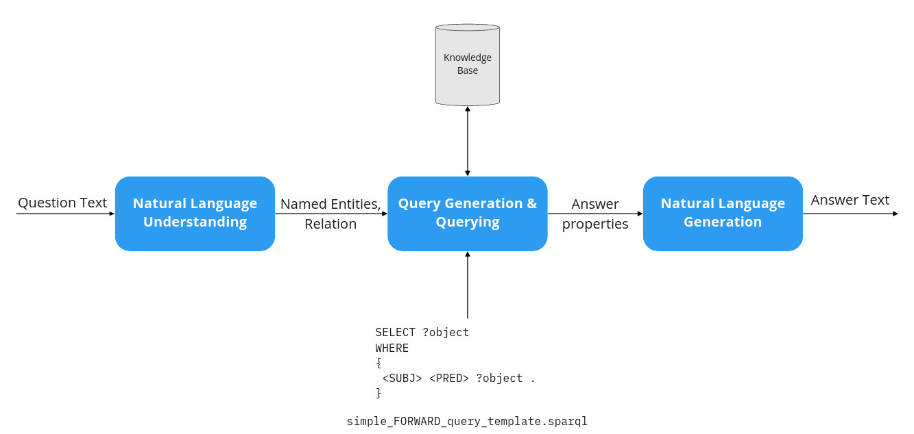

# Part №1: Simple QA System

## Context

From previous exercises, you have learned how to: write SPARQL queries, work with natural language, extract and link named entities (NEL), predict relations, and create a Client-Server application. However, to create a QA system you have to not only combine these components, but also implement another one -- Natural Language Generation (NLG). In the Figure below you can see the architecture of QA process from Server side:



Please note, that in this exercise we implement the QA system only for so-called Forward queries (`subject-predicate-?`), however, if you want to do it also for Backward queries (`?-predicate-object`) you have to additionally implement a query type classifier (it is optional).

## Learning Objectives

* Learn how to generate natural language using templates;
* Learn how to combine previously implemented components in order to create a simple QA system.

## Task

0. Re-train relation prediction model based on the new data (see repository);
1. Implement a NLG component based on templates. You have to create at least one template for every relation from the new data. Possible way of storing templates is shown below:

```
{
        "birthPlace": ["<PERSON> was born in the <LOCATION>.", "<LOCATION> is the place of birth of <PERSON>"],
        "genre": ["<ARTIST> plays in the <GENRE> genre."],
        "timeZone": ["<LOCATION> has the following time zone <TIMEZONE>", "<TIMEZONE> time zone is used in the <LOCATION>"]
}
```
Keep in mind that this example is conceptual and doesn't belong to any programming language.

2. Combine all the components together as it's shown in the Figure above;
3. Connect your Frontend and Backend such that your system can work in Question-Answer mode and prepare some questions for the Demo session.

Please, try to start structuring your code into different functions and modules. Additionally, store queries, templates, and config parameters in separate files ([hardcoding](https://softwareengineering.stackexchange.com/questions/368448/how-can-hard-coding-be-considered-a-code-smell-in-the-age-of-micro-services) is an antipattern).

## Submission check

In this Exercise, **submission check will be performed in two steps**:
1. You send the code with your solution and the README with a description of files to Moodle (as usual). Then I check it, if everything is OK, we move to the second step.
2. On the Exercise, you share your screen and show how it works.

After completion of these two steps, you pass the first part.

## Guidance / Tutorials

* Links to deployed projects from the previous year: https://moodle.hs-anhalt.de/mod/folder/view.php?id=82995
* The Frontend of the project from the previous year: https://github.com/Perevalov/nuance-web
* Simple QA system (with Frontend): https://github.com/Perevalov/kb-qa
* The Backend of the project from the previous year: https://github.com/Perevalov/nuance-core
* Creating REST Service with Java Spring: https://spring.io/guides/gs/rest-service/
* Creating REST Service with Python Flask: https://programminghistorian.org/en/lessons/creating-apis-with-python-and-flask
* How to structure large Flask applications: https://www.digitalocean.com/community/tutorials/how-to-structure-large-flask-applications#structuring-the-application-directory
* Additional help: https://moodle.hs-anhalt.de/course/view.php?id=1384

# Part 2: Qanary Integration

TODO
